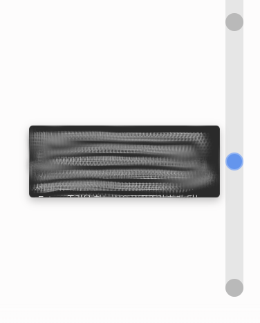

# Gemini Webpage Enhance




Simple chrome extension to enhance gemini webpage experience.

### Features

- Download chat message as markdown
- Smooth scrolling navigator to jump between messages

### How to build

```bash
pnpm install
pnpm build:zip
```

### How to apply at chrome

1. Build extension zip
2. Go to `chrome://extensions`
3. Turn on developer mode
4. Drop `gemini-chat-downloader.zip` to the page, or Click "Load unpacked" and Select the `dist` folder

### Credits

#### Icons

- [Lucide Icons](https://lucide.dev/icons/) | [ISC License](https://github.com/lucide-icons/lucide/blob/main/LICENSE)
